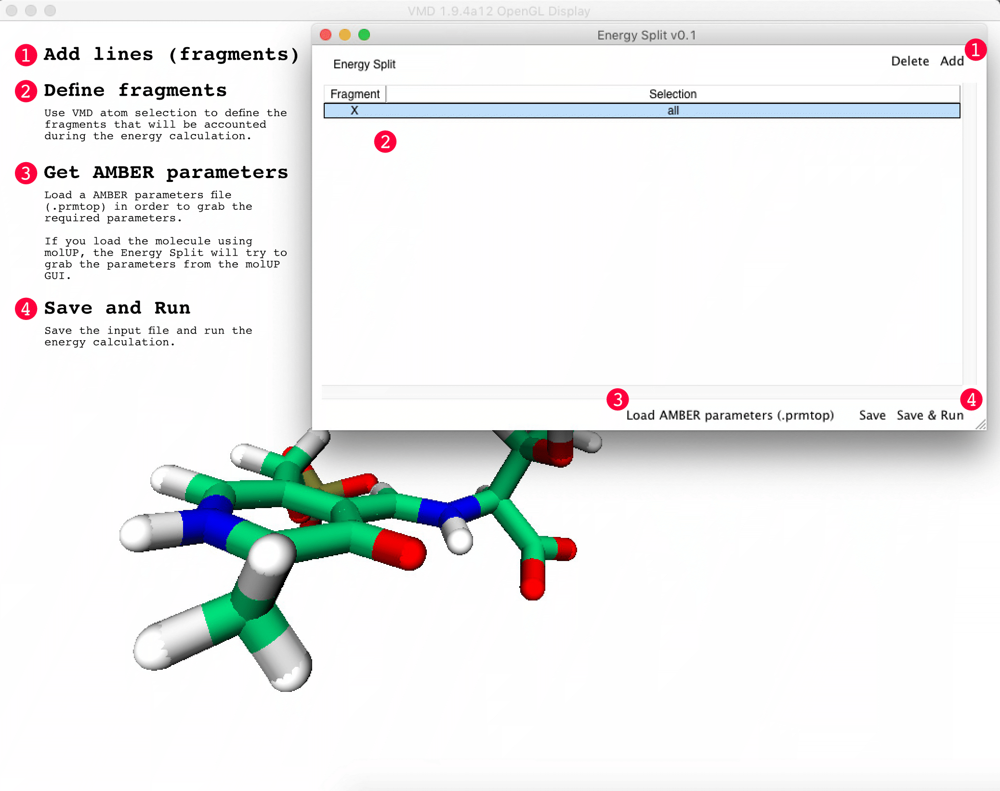

# Introduction
The energySplit is a VMD plugin that splits any molecular system and calculates the energy of each fragment using Molecular Mechanics (AMBER).

## Minimum Requirements

Operating System: macOS, Linux, and Windows

Visual Molecular Dynamics (VMD) 1.9.3 or later

Tcl 8.5 or later

## Installation

**Automatic Installation**

You could easily install molUP through [vmdStore](https://github.com/BioSIM-Research-Group/vmdStore).

**Manual Installation**
1. Download the latest release [Download](https://github.com/henriquefer/energySplit/releases/latest).
2. Copy the directory to a location on you computer. (Grab that location!)
3. Copy the text inside "install.txt" file and paste on your .vmdrc file (macOS and Linux ) or vmd.rc file (Windows).
4. Replace the string "$::vmdStorePath/plugins/energySplit" by your installation location (Step 2).
5. Save the .vmdrc or vmd.rc file.
6. Restart VMD.

**How to start?**

1. Open a structure on VMD.
2. Open the "Energy Split" available through the Extensions > VMD Store > Energy Split menu.
3. (Optional) Create fragments using atom selections (VMD style).
4. Load the AMBER parameters file (.prmtop). (1)
5. Save the input file and run the calculation. (2)

(1) If you open the structure using molUP, Energy Split will automatically grab the parameters from the molUP GUI. In that case, you do not need to import the AMBER parameters file.

(2) You can run the calculation through the Energy Split GUI or, in the Terminal, using the following command:

tclsh energySplitPath/energySplitCalculation.tcl inputfile.tcl

**Example of an output file**

## Contacts
If you have any suggestion of new features, please contact us: hfernandes@med.up.pt